# ChatBot アプリケーション設計仕様書

**作成日**: 2025年3月29日  
**バージョン**: 1.0  
**作成者**: ChatBot開発チーム

## 目次

1. [概要](#概要)
2. [システムアーキテクチャ](#システムアーキテクチャ)
3. [ファイル構造](#ファイル構造)
4. [モジュール詳細](#モジュール詳細)
5. [データモデル](#データモデル)
6. [UI設計](#ui設計)
7. [クラス図](#クラス図)
8. [フローチャート](#フローチャート)
9. [シーケンス図](#シーケンス図)
10. [APIインターフェース](#apiインターフェース)
11. [セキュリティ考慮事項](#セキュリティ考慮事項)
12. [パフォーマンス最適化](#パフォーマンス最適化)
13. [テスト計画](#テスト計画)
14. [拡張計画](#拡張計画)

## 概要

ChatBotはAI搭載のWebベースチャットアプリケーションです。OpenAIのAPIとAzure OpenAI APIを活用して、ユーザーに高度な対話体験を提供します。マークダウン形式のメッセージ表示、コードハイライト、ファイル添付機能などを備えた多機能アプリケーションです。

### 主な機能

- 複数のAIモデル対応（gpt-4o-mini、gpt-4o、o1-mini、o1）
- OpenAI/Azure OpenAI API対応
- ストリーミングレスポンス機能（リアルタイムでAI応答を表示）
- マークダウン・コードシンタックスハイライト対応
- チャット履歴管理（保存・復元・削除・名前変更）
- システムプロンプトのカスタマイズとテンプレート機能
- ファイル添付機能
- コード実行機能（JavaScript、Python、C++、HTML）
- レスポンシブデザイン

## システムアーキテクチャ

ChatBotはクライアントサイドのみで動作するSPA（Single Page Application）として設計されています。すべてのデータ処理と状態管理はブラウザ内で行われ、外部との通信はOpenAI/Azure OpenAI APIのみです。

### アーキテクチャ概略図

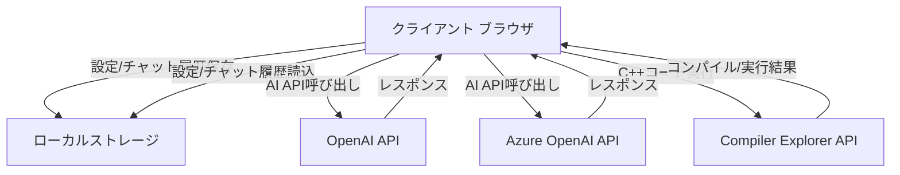

## ファイル構造

ChatBotアプリケーションは以下のファイル構造で構成されています:

```
ChatBot/
│
├── index.html               # メインのHTMLファイル
├── main.js                  # アプリケーションのエントリーポイント
├── ChatBot_設計仕様書.md    # 本設計仕様書
├── README.md                # プロジェクト概要説明
│
├── css/                     # スタイルシート関連ファイル
│   ├── base/                # 基本スタイル
│   │   ├── base.css         # 基本スタイル定義
│   │   └── variables.css    # CSS変数定義
│   ├── components/          # コンポーネント別スタイル
│   │   ├── animations/      # アニメーション
│   │   ├── buttons/         # ボタン
│   │   ├── chat/            # チャットUI
│   │   ├── code/            # コード実行
│   │   ├── file-preview/    # ファイルプレビュー
│   │   ├── forms/           # フォーム
│   │   ├── modals/          # モーダル
│   │   ├── prompt/          # プロンプト
│   │   └── settings/        # 設定メニュー
│   └── layouts/             # レイアウト
│       └── layout.css       # ページレイアウト
│
├── icon/                    # アプリケーションで使用するアイコン類
│   └── ChatBot.png          # アプリケーションアイコン
│
└── js/                      # JavaScriptモジュール
    ├── components/          # UI・機能コンポーネント
    │   ├── chat/            # チャット関連コンポーネント
    │   │   ├── chatActions.js      # チャットアクション
    │   │   ├── chatAttachmentViewer.js # 添付ファイル表示
    │   │   ├── chatHistory.js      # チャット履歴管理
    │   │   ├── chatRenderer.js     # チャット表示
    │   │   └── chatUI.js           # チャットUI
    │   ├── fileAttachment/  # ファイル添付関連
    │   │   ├── fileAttachment.js   # ファイル添付機能
    │   │   └── fileAttachmentUI.js # ファイル添付UI
    │   └── sidebar/         # サイドバー関連
    │       └── sidebar.js         # サイドバー管理
    │
    ├── core/                # コア機能モジュール
    │   ├── api.js           # API通信
    │   ├── appState.js      # アプリケーション状態管理
    │   ├── config.js        # 設定管理
    │   ├── domElements.js   # DOM要素参照
    │   ├── eventHandlers.js # イベントハンドラー
    │   ├── storage.js       # ストレージ操作
    │   ├── ui.js            # UI操作共通
    │   ├── uiCache.js       # UI要素キャッシュ
    │   ├── uiUtils.js       # UI操作ユーティリティ
    │   └── executors/       # コード実行機能
    │       ├── codeExecutor.js     # コード実行管理
    │       └── languages/          # 言語別実行モジュール
    │           ├── CPPExecutor.js      # C++実行
    │           ├── ExecutorBase.js     # 基底クラス
    │           ├── HTMLExecutor.js     # HTML実行
    │           ├── JavaScriptExecutor.js # JavaScript実行
    │           └── PythonExecutor.js   # Python実行
    │
    ├── modals/              # モーダルダイアログ管理
    │   ├── modalHandlers.js      # モーダル共通ハンドラー
    │   ├── apiSettings/         # API設定モーダル
    │   │   └── apiSettingsModal.js
    │   ├── promptManager/       # プロンプト管理モーダル
    │   │   └── promptManagerModal.js
    │   ├── renameChat/          # チャット名変更モーダル
    │   │   └── renameChatModal.js
    │   └── systemPrompt/        # システムプロンプト設定モーダル
    │       └── systemPromptModal.js
    │
    └── utils/               # ユーティリティモジュール
        ├── cryptoHelper.js  # 暗号化/復号化
        ├── fileConverter.js # ファイル変換
        ├── fileHandler.js   # ファイル処理
        ├── fileReader.js    # ファイル読込
        ├── fileValidator.js # ファイル検証
        └── markdown.js      # マークダウン処理
```

## モジュール詳細

各モジュールの詳細な役割と責任範囲を説明します。

### main.js

アプリケーションのエントリーポイントであり、初期化処理およびコアロジックを実装しています。

**主な責任**:
- アプリケーションの初期化処理
- イベントリスナーのセットアップ
- 外部ライブラリの動的読み込み
- 会話の初期ロード
- Prism.jsコンポーネント管理

### コアモジュール

#### js/core/api.js (AIAPIクラス)

APIとの通信を担当するモジュールです。

**主な責任**:
- OpenAI APIとの通信
- Azure OpenAI APIとの通信
- エラーハンドリング
- リクエスト/レスポンスの整形
- ストリーミングレスポンスの処理
- 添付ファイルの処理

#### js/core/appState.js

アプリケーションの状態管理を担当します。

**主な責任**:
- 現在の会話状態管理
- 会話履歴の管理
- API設定の管理
- システムプロンプトの管理
- 添付ファイルの状態管理

#### js/core/config.js

アプリケーション設定の管理を担当します。

**主な責任**:
- デフォルト設定値の定義
- 設定情報の構造定義
- ファイル処理の設定
- UIパラメータの定義
- モデル設定の管理

#### js/core/domElements.js

DOM要素への参照を一元管理します。

**主な責任**:
- DOM要素IDの定義
- DOM要素へのアクセス提供

#### js/core/eventHandlers.js (EventHandlersクラス)

イベントハンドラーの設定を管理するモジュールです。

**主な責任**:
- チャット関連イベントの設定
- 設定関連イベントの設定
- ファイル関連イベントの設定
- グローバルイベントの設定
- モーダル関連イベントの設定

#### js/core/storage.js (Storageクラス)

ローカルストレージを使ったデータ永続化を担当します。

**主な責任**:
- API設定の保存/読込
- 会話履歴の保存/読込
- システムプロンプトの保存/読込
- プロンプトテンプレートの管理
- カテゴリ状態の保存/読込
- 添付ファイルの保存/読込

#### js/core/ui.js (UIクラス)

UI操作のコア機能を提供します。

**主な責任**:
- テーマ設定（ダーク/ライト）
- 通知表示
- モーダルダイアログ表示
- アクセシビリティ機能
- タッチデバイス最適化
- パフォーマンス最適化

#### js/core/uiCache.js (UICacheクラス)

DOM要素のキャッシュを管理します。

**主な責任**:
- DOM要素の効率的な取得と保存
- 要素キャッシュの管理

#### js/core/uiUtils.js (UIUtilsクラス)

UI操作のユーティリティ機能を提供します。

**主な責任**:
- 要素の表示/非表示切替
- モーダル表示/非表示切替
- 要素の動的生成
- テキストエリアの自動リサイズ

### コンポーネントモジュール

#### js/components/chat/chatActions.js (ChatActionsクラス)

チャット関連のアクションを担当します。

**主な責任**:
- メッセージの送信
- 会話の作成
- 会話のクリア
- 会話履歴の表示
- 会話の切り替え・削除

#### js/components/chat/chatAttachmentViewer.js (ChatAttachmentViewerクラス)

添付ファイルの表示機能を提供します。

**主な責任**:
- 添付ファイルのプレビュー生成
- 画像ファイルの表示
- テキストファイルの表示・整形
- コードのシンタックスハイライト

#### js/components/chat/chatHistory.js (ChatHistoryクラス)

チャット履歴管理を担当します。

**主な責任**:
- 会話履歴の表示
- アクティブチャットの更新
- 会話の表示
- タイムスタンプの整形

#### js/components/chat/chatRenderer.js (ChatRendererクラス)

チャットメッセージのレンダリングを担当します。

**主な責任**:
- メッセージの表示
- ストリーミングレスポンスの表示
- マークダウンのレンダリング
- コードのシンタックスハイライト

#### js/components/chat/chatUI.js (ChatUIクラス)

チャットUIの管理を担当します。

**主な責任**:
- チャットUIの初期化
- スクロール管理
- メッセージ入力管理
- UI状態の更新

#### js/components/fileAttachment/fileAttachment.js (FileAttachmentクラス)

ファイル添付機能の管理を担当します。

**主な責任**:
- 添付ファイルのクリア
- API用添付ファイル変換
- 会話用添付ファイルの保存
- 保存済み添付ファイルの表示

#### js/components/fileAttachment/fileAttachmentUI.js (FileAttachmentUIクラス)

ファイル添付のUI管理を担当します。

**主な責任**:
- 添付ファイルのプレビュー表示
- プレビューのクリア
- ファイル情報の表示
- 削除ボタンの管理

#### js/components/sidebar/sidebar.js (Sidebarクラス)

サイドバーの管理を担当します。

**主な責任**:
- サイドバーの表示/非表示切替
- サイドバートグルボタンの作成
- レスポンシブデザイン対応

### モーダルモジュール

#### js/modals/apiSettings/apiSettingsModal.js (ApiSettingsModalクラス)

API設定モーダルを管理します。

**主な責任**:
- API設定モーダルの表示/非表示
- OpenAI/Azure設定フォームの切替
- モデル別エンドポイント設定管理

#### js/modals/promptManager/promptManagerModal.js (PromptManagerModalクラス)

プロンプト管理モーダルを担当します。

**主な責任**:
- プロンプト一覧の表示
- プロンプトの追加/編集/削除
- カテゴリ管理
- プロンプト検索

#### js/modals/renameChat/renameChatModal.js (RenameChatModalクラス)

チャット名変更モーダルを管理します。

**主な責任**:
- チャット名変更モーダルの表示/非表示
- チャット情報の取得・表示

#### js/modals/systemPrompt/systemPromptModal.js (SystemPromptModalクラス)

システムプロンプト設定モーダルを管理します。

**主な責任**:
- システムプロンプトモーダルの表示/非表示
- テンプレート一覧の表示
- カテゴリ表示の管理

#### js/modals/modalHandlers.js (ModalHandlersクラス)

モーダルのイベントハンドラーを管理します。

**主な責任**:
- API設定の保存
- チャット名変更の保存
- システムプロンプトの保存
- テンプレート選択・削除処理

### コード実行モジュール

#### js/core/executors/codeExecutor.js (CodeExecutorクラス)

コード実行機能の管理を担当します。

**主な責任**:
- コード実行の初期化
- 言語検出
- 言語別エグゼキュータの選択

#### js/core/executors/languages/ExecutorBase.js (ExecutorBaseクラス)

言語実行クラスの基底クラスです。

**主な責任**:
- 実行環境の共通インターフェース定義
- ランタイム読み込み
- 実行結果の標準化

#### js/core/executors/languages/JavaScriptExecutor.js (JavaScriptExecutorクラス)

JavaScript実行を担当します。

**主な責任**:
- JavaScript実行環境のセットアップ
- コードの実行
- 結果の表示

#### js/core/executors/languages/PythonExecutor.js (PythonExecutorクラス)

Python実行を担当します。

**主な責任**:
- Pyodideランタイムの読み込み
- Pythonコードの実行
- 結果の表示

#### js/core/executors/languages/CPPExecutor.js (CPPExecutorクラス)

C++実行を担当します。Compiler Explorer (Godbolt) APIを使用してC++コードのコンパイルと実行を行います。

**主な責任**:
- Godbolt APIを使用したC++コードの実行
- コンパイラオプションの管理
- 実行結果とコンパイラ出力の処理
- エラーハンドリング

#### js/core/executors/languages/HTMLExecutor.js (HTMLExecutorクラス)

HTML実行を担当します。

**主な責任**:
- iframeによる実行環境構築
- HTML/CSS/JSの組み合わせ処理
- 結果の表示

### ユーティリティモジュール

#### js/utils/cryptoHelper.js (CryptoHelperクラス)

暗号化機能を提供します。

**主な責任**:
- APIキーの暗号化
- 暗号化データの復号化
- 暗号化キーの生成

#### js/utils/fileConverter.js (FileConverterクラス)

ファイル変換機能を提供します。

**主な責任**:
- ファイルのBase64変換
- ファイルオブジェクトの整形
- 添付ファイル形式への変換

#### js/utils/fileHandler.js (FileHandlerクラス)

ファイル操作の基本機能を提供します。

**主な責任**:
- ファイル選択処理
- 添付ファイル通知
- 許可ファイル拡張子管理
- 選択ファイルのクリア

#### js/utils/fileReader.js (FileReaderクラス)

ファイル読み込み機能を提供します。

**主な責任**:
- ファイルの非同期読み込み
- ファイルタイプ別読み込み処理
- バイナリ/テキスト変換

#### js/utils/fileValidator.js (FileValidatorクラス)

ファイル検証機能を提供します。

**主な責任**:
- ファイルタイプ検証
- ファイルサイズ検証
- 拡張子検証

#### js/utils/markdown.js (Markdownクラス)

マークダウン処理機能を提供します。

**主な責任**:
- マークダウンテキストのレンダリング
- コードブロックの抽出
- シンタックスハイライト
- マークダウンライブラリ管理

## データモデル

ChatBotアプリケーションで使用される主要なデータモデルは以下の通りです。これらのデータ構造はJavaScriptオブジェクトとして実装され、ローカルストレージに保存されます。

### 会話データモデル

会話データは以下の構造で保存されます：

```javascript
{
    // 会話の配列
    conversations: [
        {
            id: "1680123456789",                 // 会話ID（タイムスタンプベース）
            title: "新しいチャット",             // 会話タイトル
            model: "gpt-4o",                    // 使用モデル
            timestamp: 1680123456789,           // 作成/更新日時
            messages: [                          // メッセージ配列
                {
                    role: "system",              // システムメッセージ
                    content: "あなたは優秀なAIアシスタントです。"
                },
                {
                    role: "user",                // ユーザーメッセージ
                    content: "こんにちは",
                    timestamp: 1680123456790     // メッセージ送信時間
                },
                {
                    role: "assistant",           // アシスタントメッセージ
                    content: "こんにちは！何かお手伝いできることはありますか？",
                    timestamp: 1680123456900
                }
            ]
        }
    ],
    // 現在選択中の会話ID
    currentConversationId: "1680123456789"
}
```

### API設定データモデル

API設定は以下の構造で保存されます：

```javascript
{
    apiType: "openai",                       // "openai" または "azure"
    openaiApiKey: "encrypted_key_data",      // 暗号化されたOpenAI APIキー
    azureApiKey: "encrypted_key_data",       // 暗号化されたAzure APIキー
    azureEndpoints: {                        // Azure用各モデルのエンドポイント
        "gpt-4o-mini": "https://example-gpt4o-mini.openai.azure.com/...",
        "gpt-4o": "https://example-gpt4o.openai.azure.com/...",
        "o1-mini": "https://example-o1-mini.openai.azure.com/...",
        "o1": "https://example-o1.openai.azure.com/..."
    }
}
```

### システムプロンプトデータモデル

システムプロンプトとテンプレートは以下の構造で保存されます：

```javascript
{
    // 現在のシステムプロンプト
    systemPrompt: "あなたは優秀なAIアシスタントです。ユーザーの質問に丁寧に回答してください。",
    
    // システムプロンプトテンプレート集
    systemPromptTemplates: {
        "一般アシスタント": {
            content: "あなたは優秀なAIアシスタントです。ユーザーの質問に丁寧に回答してください。",
            category: "基本",
            description: "標準的なアシスタント設定",
            tags: ["一般", "標準"]
        },
        "コードレビュー": {
            content: "あなたはプログラミングの専門家です。提供されたコードを分析し、問題点や改善点を指摘してください。",
            category: "プログラミング",
            description: "コードのレビューを行うプロンプト",
            tags: ["コード", "レビュー", "プログラミング"]
        }
    }
}
```

### 添付ファイルデータモデル

添付ファイルは以下の構造で保存されます：

```javascript
{
    files: [
        {
            id: "file-1680123456789",            // ファイルID
            name: "example.js",                  // ファイル名
            type: "file",                        // "file" または "image"
            size: 1024,                          // サイズ（バイト）
            mimeType: "application/javascript",  // MIMEタイプ
            content: "function hello() {...}",   // テキストコンテンツ（テキストファイルの場合）
            data: "data:image/jpeg;base64,...",  // Base64エンコードされたデータ（画像の場合）
            timestamp: 1680123456789             // 添付時間
        }
    ]
}
```

### 設定データモデル

アプリケーション設定は以下の構造で保存されます：

```javascript
{
    theme: "dark",                            // "dark" または "light"
    fontSize: "medium",                       // "small", "medium", "large"
    codeAutoFormatting: true,                 // コード自動フォーマット
    messageLayout: "bubbles",                 // "bubbles" または "flat"
    categoryStates: {                         // カテゴリの展開/折りたたみ状態
        "基本": false,                         // false = 展開, true = 折りたたみ
        "プログラミング": true
    }
}
```

### データフロー

これらのデータモデル間の関係と処理フローを以下に示します。

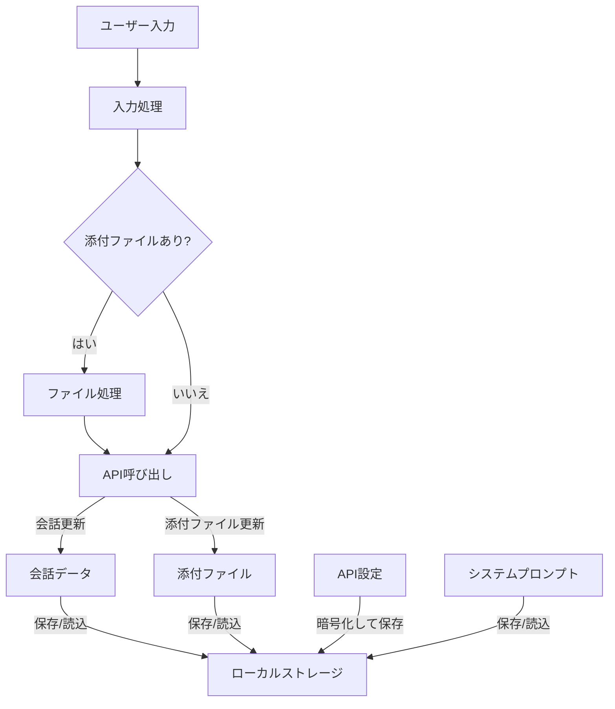

## UI設計

ChatBotアプリケーションのUI設計は、直感的な操作性、レスポンシブ性、アクセシビリティを考慮して設計されています。

### 画面レイアウト

アプリケーションは以下の主要なUI領域で構成されています：

1. **サイドバー** - 会話履歴と各種設定メニューへのアクセスを提供
2. **メインチャットエリア** - メッセージの表示と入力を行う中心的なエリア
3. **モーダルダイアログ** - 設定やプロンプト管理などのオーバーレイUI

```
+-------------------------------------------+
|  +--------+  +-------------------------+  |
|  |        |  |                         |  |
|  | サイド |  |  チャットメッセージ表示  |  |
|  | バー   |  |                         |  |
|  |        |  |                         |  |
|  | 会話   |  |                         |  |
|  | 履歴   |  |                         |  |
|  |        |  |                         |  |
|  | 新規   |  |                         |  |
|  | チャット|  |                         |  |
|  |        |  |                         |  |
|  | 設定   |  |                         |  |
|  |        |  +-------------------------+  |
|  +--------+  | ファイル添付 | モデル選択 |  |
|              +-------------------------+  |
|              | メッセージ入力          |  |
|              +-------------------------+  |
+-------------------------------------------+
```

### サイドバー

```
+--------------------+
| + 新しいチャット    |
+--------------------+
| 会話履歴:          |
|                    |
| > 現在のチャット    |
|   チャット1        |
|   チャット2        |
|   ...             |
+--------------------+
| 設定:              |
|   API設定          |
|   システムプロンプト|
|   プロンプト管理    |
|   テーマ切替        |
+--------------------+
| 履歴クリア         |
+--------------------+
```

**主な機能**:
- 新規チャット作成ボタン
- 会話履歴リスト（スクロール可能）
- 各種設定へのアクセスメニュー
- 履歴クリアボタン
- モバイル表示時は収納可能（ハンバーガーメニュー）

### メインチャットエリア

```
+------------------------------------------+
|                                          |
| システム: あなたは優秀なAIアシスタント...  |
|                                          |
| ユーザー: こんにちは                      |
|                                          |
| アシスタント: こんにちは！何かお手伝い...  |
|                                          |
|                                          |
+------------------------------------------+
| [ファイル] [画像]  | モデル: [gpt-4o ▼]  |
+------------------------------------------+
| メッセージを入力...                      |
|                                [送信 ▶]  |
+------------------------------------------+
```

**主な機能**:
- メッセージ表示エリア（システム/ユーザー/アシスタント）
- マークダウン表示とコードハイライト
- ファイル添付ボタン
- モデル選択ドロップダウン
- メッセージ入力エリア（自動リサイズ）
- 送信ボタン

### モーダルダイアログ（API設定）

```
+------------------------------------------+
| API設定                           [×]  |
+------------------------------------------+
| APIタイプ:                              |
| ○ OpenAI API   ● Azure OpenAI API      |
+------------------------------------------+
| APIキー:                                |
| [********************************]      |
+------------------------------------------+
| Azure エンドポイント:                    |
|                                          |
| gpt-4o-mini:                            |
| [https://example.openai.azure.com/...]  |
|                                          |
| gpt-4o:                                 |
| [https://example.openai.azure.com/...]  |
|                                          |
+------------------------------------------+
| [キャンセル]                   [保存]    |
+------------------------------------------+
```

### モーダルダイアログ（システムプロンプト）

```
+------------------------------------------+
| システムプロンプト設定              [×]  |
+------------------------------------------+
| [                                       |
|  あなたは優秀なAIアシスタントです...     |
|                                         |
|                                       ] |
+------------------------------------------+
| テンプレート:                           |
|                                          |
| 基本 ▼                                  |
| ├── 一般アシスタント                     |
| ├── 文章校正                            |
| └── ブレインストーミング                 |
|                                          |
| プログラミング ▼                         |
| ├── コードレビュー                       |
| ├── バグ修正                            |
| └── ...                                |
+------------------------------------------+
| [新規テンプレート保存]  [プロンプト管理] |
+------------------------------------------+
| [キャンセル]                   [保存]    |
+------------------------------------------+
```

### ファイル添付プレビュー

```
+------------------------------------------+
| 添付ファイル:                            |
|                                          |
| +---------------+  +---------------+     |
| | [コード]      |  | [画像]        |     |
| | example.js    |  | image.jpg     |     |
| | 3.2KB        ×|  | 150KB        ×|     |
| +---------------+  +---------------+     |
|                                          |
+------------------------------------------+
```

### レスポンシブデザイン

アプリケーションは以下のブレークポイントに対応したレスポンシブデザインを採用しています：

- **モバイル**: <576px
  - サイドバーは非表示（ハンバーガーメニューで表示）
  - 単一カラムレイアウト
  - コンパクトなコントロール

- **タブレット**: 576px-992px
  - サイドバーはコンパクト表示
  - メインエリアの幅を確保

- **デスクトップ**: >992px
  - サイドバーとメインエリアの2カラムレイアウト
  - 最適な閲覧/編集体験

### テーマ

アプリケーションはダークテーマとライトテーマの2つのカラーモードをサポートしています：

**ダークテーマ**:
- 背景: #1e1e2e
- サイドバー背景: #181825
- テキスト: #cdd6f4
- アクセントカラー: #89b4fa
- エラーカラー: #f38ba8

**ライトテーマ**:
- 背景: #ffffff
- サイドバー背景: #f5f5f5
- テキスト: #333333
- アクセントカラー: #1e88e5
- エラーカラー: #e53935

### アクセシビリティ

アプリケーションは以下のアクセシビリティ機能を実装しています：

- 適切なコントラスト比（WCAG 2.1 AA準拠）
- キーボードナビゲーション対応
- スクリーンリーダー互換（ARIA属性）
- フォーカス可視化
- フォントサイズ調整機能
- ショートカットキー
  - Ctrl+Enter: メッセージ送信
  - Ctrl+/: 新規チャット
  - Esc: モーダルを閉じる

## クラス図

以下のクラス図はアプリケーションの主要クラスとその関連性を示しています。シングルトンパターンを採用している多くのクラスやコンポーネント間の実際の依存関係を表現しています。

```mermaid
classDiagram
    %% コアクラス
    class UI {
        -static #instance
        +static getInstance()
        -constructor()
        +initialize()
        +Core~Theme
        +Core~Notification
        +Core~Modal
        +Core~Accessibility
        +Core~TouchOptimization
    }
    
    class Storage {
        -static #instance
        +static getInstance()
        -constructor()
        +setItem(key, value)
        +getItem(key)
        +saveConversations()
        +loadConversations()
        +saveSystemPrompt()
        +loadSystemPrompt()
        +saveApiSettings()
        +loadApiSettings()
        +saveAttachments()
        +loadAttachments()
        +saveCategoryState()
        +loadCategoryState()
    }
    
    class UIUtils {
        -static #instance
        +static getInstance()
        -constructor()
        +toggleVisibility()
        +toggleModal()
        +createElement(tag, props)
        +autoResizeTextarea()
        +scrollToBottom()
    }
    
    class UICache {
        -static #instance
        +static getInstance()
        -constructor()
        +get(selector, useQuerySelector)
        +set(selector, element)
        +clear()
    }
    
    class EventHandlers {
        -static #instance
        +static getInstance()
        -constructor()
        +setupChatEvents()
        +setupSettingsEvents()
        +setupFileEvents()
        +setupGlobalEvents()
        +setupModalEvents()
        -#setupSystemPromptModal()
        -#setupApiKeyModal()
        -#setupRenameChatModal()
        -#setupPromptManagerModal()
    }
    
    class AIAPI {
        -static #instance
        +static getInstance()
        -constructor()
        +sendMessage()
        +sendMessageStream()
        -processAttachments()
        -performOpenAIRequest()
        -performAzureRequest()
    }
    
    %% チャットコンポーネント
    class ChatActions {
        -static #instance
        +static getInstance()
        -constructor()
        +sendMessage()
        +createNewConversation()
        +clearAllHistory()
        +renderChatHistory()
        -#switchConversation()
        -#deleteConversation()
    }
    
    class ChatHistory {
        -static #instance
        +static getInstance()
        -constructor()
        +renderChatHistory()
        +updateActiveChatInHistory()
        +displayConversation()
        -formatTimestamp()
    }
    
    class ChatRenderer {
        -static #instance
        +static getInstance()
        -constructor()
        +renderUserMessage()
        +renderBotMessage()
        +clearStreamingMessage()
        +updateStreamingMessage()
        -highlightCode()
    }
    
    class ChatAttachmentViewer {
        -static #instance
        +static getInstance()
        -constructor()
        +createAttachmentsElement()
        +showFullSizeImage()
        -createImageAttachment()
        -createFileAttachment()
        -formatTextContent()
    }
    
    class ChatUI {
        -static #instance
        +static getInstance()
        -constructor()
        +createElement(tag, options)
        +formatTimestamp()
        +adjustScroll()
    }
    
    %% ファイル関連クラス
    class FileAttachment {
        -static #instance
        +static getInstance()
        -constructor()
        +clearAttachments()
        +getAttachmentsForAPI()
        +saveAttachmentsForConversation()
        +displaySavedAttachments()
        -loadAttachmentsForConversation()
        -findClosestMessageIndex()
    }
    
    class FileAttachmentUI {
        -static #instance
        +static getInstance()
        -constructor()
        +updatePreview()
        +clearPreview()
        -#getOrCreatePreviewArea()
        -#createFilePreviewItems()
        -#createFilePreview()
        -#createImagePreview()
        -#createFileInfo()
    }
    
    class FileHandler {
        -static #instance
        +static getInstance()
        -constructor()
        +selectedFiles
        +savedAttachments
        +attachmentTimestamp
        +init()
        +updateAcceptedFileTypes()
        +handleFileSelect()
        +notifyAttachmentComplete()
        +clearSelectedFiles()
        -getAllowedFileExtensions()
    }
    
    class FileConverter {
        -static #instance
        +static getInstance()
        -constructor()
        +convertFilesToAttachments()
        -convertFileToAttachment()
        -convertImageToAttachment()
        -convertTextToAttachment()
    }
    
    class FileReaderUtil {
        -static #instance
        +static getInstance()
        -constructor()
        +readAsDataURL()
        +readAsText()
        +readAsArrayBuffer()
    }
    
    class FileValidator {
        -static #instance
        +static getInstance()
        -constructor()
        +validateFiles()
        -checkFileType()
        -checkFileSize()
        -checkFileExtension()
    }
    
    %% ユーティリティクラス
    class Markdown {
        -static #instance
        +static getInstance()
        -constructor()
        -_libraryStatus
        +initializeMarkdown()
        +loadScript()
        +renderMarkdown()
        +escapeHtml()
        +getCodeLanguage()
    }
    
    class CryptoHelper {
        -static #instance
        +static getInstance()
        -constructor()
        +encrypt()
        +decrypt()
        -generateEncryptionKey()
    }
    
    %% モーダルクラス
    class ApiSettingsModal {
        -static #instance
        +static getInstance()
        -constructor()
        +showApiKeyModal()
        +hideApiKeyModal()
        +toggleAzureSettings()
    }
    
    class SystemPromptModal {
        -static #instance
        +static getInstance()
        -constructor()
        +showSystemPromptModal()
        +hideSystemPromptModal()
        +updateList()
        -createPromptItem()
    }
    
    class PromptManagerModal {
        -static #instance
        +static getInstance()
        -constructor()
        +showPromptManagerModal()
        +hidePromptManagerModal()
        +showPromptEditModal()
        +hidePromptEditModal()
        +handleAddCategory()
        -updatePromptCategories()
    }
    
    class RenameChatModal {
        -static #instance
        +static getInstance()
        -constructor()
        +showRenameChatModal()
        +hideRenameChatModal()
    }
    
    class ModalHandlers {
        -static #instance
        +static getInstance()
        -constructor()
        +saveApiSettings()
        +saveRenamedChat()
        +saveNewSystemPrompt()
        +onTemplateSelect()
        +onTemplateDelete()
    }
    
    %% サイドバークラス
    class Sidebar {
        -static #instance
        +static getInstance()
        -constructor()
        +toggleSidebar()
        +createToggleButton()
        -handleResize()
    }
    
    %% コード実行クラス
    class ExecutorBase {
        +execute(code)* 
        #_loadRuntime()*
        #_executeCode(code)*
        #_formatResult(result)*
    }
    
    class JavaScriptExecutor {
        -static #instance
        +static getInstance()
        -constructor()
        +execute(code)
        #_loadRuntime()
        #_executeCode(code)
        #_formatResult(result)
    }
    
    class PythonExecutor {
        -static #instance
        +static getInstance()
        -constructor()
        +execute(code)
        #_loadRuntime()
        #_executeCode(code)
        #_formatResult(result)
    }
    
    class CPPExecutor {
        -static #instance
        +static getInstance()
        -constructor()
        +execute(code)
        #_loadRuntime()
        #_executeCode(code)
        #_formatResult(result)
    }
    
    class HTMLExecutor {
        -static #instance
        +static getInstance()
        -constructor()
        +execute(code)
        #_loadRuntime()
        #_executeCode(code)
        #_formatResult(result)
    }
    
    class CodeExecutor {
        -static #instance
        +static getInstance()
        -constructor()
        +detectLanguage()
        +execute()
        -getExecutor()
    }
    
    %% 継承関係
    ExecutorBase <|-- JavaScriptExecutor
    ExecutorBase <|-- PythonExecutor
    ExecutorBase <|-- CPPExecutor
    ExecutorBase <|-- HTMLExecutor
    
    %% コアクラス間の関係
    UI --> UICache
    UI --> UIUtils
    UI ..> Storage: 設定読み込み・保存
    EventHandlers --> UICache: DOM要素取得
    EventHandlers --> ChatActions: イベント委譲
    EventHandlers --> FileHandler: イベント委譲
    EventHandlers --> ModalHandlers: イベント委譲
    
    %% モーダル関連
    EventHandlers --> ApiSettingsModal: モーダル表示・非表示
    EventHandlers --> SystemPromptModal: モーダル表示・非表示
    EventHandlers --> RenameChatModal: モーダル表示・非表示
    EventHandlers --> PromptManagerModal: モーダル表示・非表示
    ModalHandlers --> ApiSettingsModal: モーダル制御
    ModalHandlers --> SystemPromptModal: モーダル制御
    ModalHandlers --> RenameChatModal: モーダル制御
    ModalHandlers --> PromptManagerModal: モーダル制御
    ModalHandlers --> Storage: 設定保存
    ModalHandlers --> UICache: DOM要素取得
    ModalHandlers --> UI: 通知表示
    ApiSettingsModal --> UICache: DOM要素取得
    SystemPromptModal --> UICache: DOM要素取得
    SystemPromptModal --> Storage: テンプレート取得
    RenameChatModal --> UICache: DOM要素取得
    PromptManagerModal --> UICache: DOM要素取得
    PromptManagerModal --> Storage: テンプレート取得
    
    %% ファイル関連
    FileHandler --> FileValidator: ファイル検証
    FileHandler --> FileAttachmentUI: プレビュー更新
    FileHandler --> FileConverter: ファイル変換
    FileAttachment --> Storage: 添付ファイル保存・読込
    FileAttachment --> FileHandler: ファイル情報取得
    FileAttachment --> ChatAttachmentViewer: 添付ファイル表示
    FileAttachmentUI --> FileHandler: ファイル情報取得
    FileConverter --> FileReaderUtil: ファイル読込
    
    %% チャット関連
    ChatActions --> AIAPI: API通信
    ChatActions --> Storage: 会話保存・読込
    ChatActions --> ChatHistory: 会話表示
    ChatActions --> ChatRenderer: メッセージ表示
    ChatActions --> FileAttachment: 添付ファイル処理
    ChatActions --> FileHandler: ファイル処理
    ChatActions --> UIUtils: テキストエリアリサイズ
    ChatActions --> RenameChatModal: モーダル表示
    
    ChatHistory --> UIUtils: スクロール制御
    ChatHistory --> ChatRenderer: メッセージ表示
    ChatHistory --> ChatUI: 要素生成
    ChatHistory --> FileAttachment: 添付ファイル表示
    
    ChatRenderer --> Markdown: マークダウン処理
    ChatRenderer --> UIUtils: DOM要素生成
    ChatRenderer --> ChatUI: 要素生成
    ChatRenderer --> ChatAttachmentViewer: 添付ファイル表示
    ChatRenderer --> CodeExecutor: コード実行
    
    ChatAttachmentViewer --> Markdown: コード表示処理
    ChatAttachmentViewer --> ChatUI: 要素生成
    
    %% コード実行関連
    CodeExecutor --> JavaScriptExecutor: 実行委譲
    CodeExecutor --> PythonExecutor: 実行委譲
    CodeExecutor --> CPPExecutor: 実行委譲
    CodeExecutor --> HTMLExecutor: 実行委譲
    
    %% サイドバー関連
    Sidebar --> UICache: DOM要素取得
    
    %% API関連
    AIAPI --> CryptoHelper: APIキー復号化
    AIAPI --> FileConverter: 添付ファイル処理
    AIAPI --> Storage: API設定取得
```

この図では、アプリケーションの主要なクラス間の実際の依存関係を表現しています。各クラスはシングルトンパターンを採用しており、`getInstance()`メソッドを通じて唯一のインスタンスにアクセスします。

主な関係性の種類:
- 実線矢印(`-->`)は、あるクラスが別のクラスを直接利用していることを示します
- 点線矢印(`..>`)は、弱い依存関係を示します
- 三角矢印(`<|--`)は継承関係を示します

依存関係の方向は、依存元から依存先へ向かう矢印で表現しています。例えば、`ChatRenderer --> ChatUI`は、ChatRendererクラスがChatUIクラスに依存していることを示します。

## フローチャート

以下はChatBotアプリケーションの主要な処理フローチャートです。

### アプリケーション初期化フロー

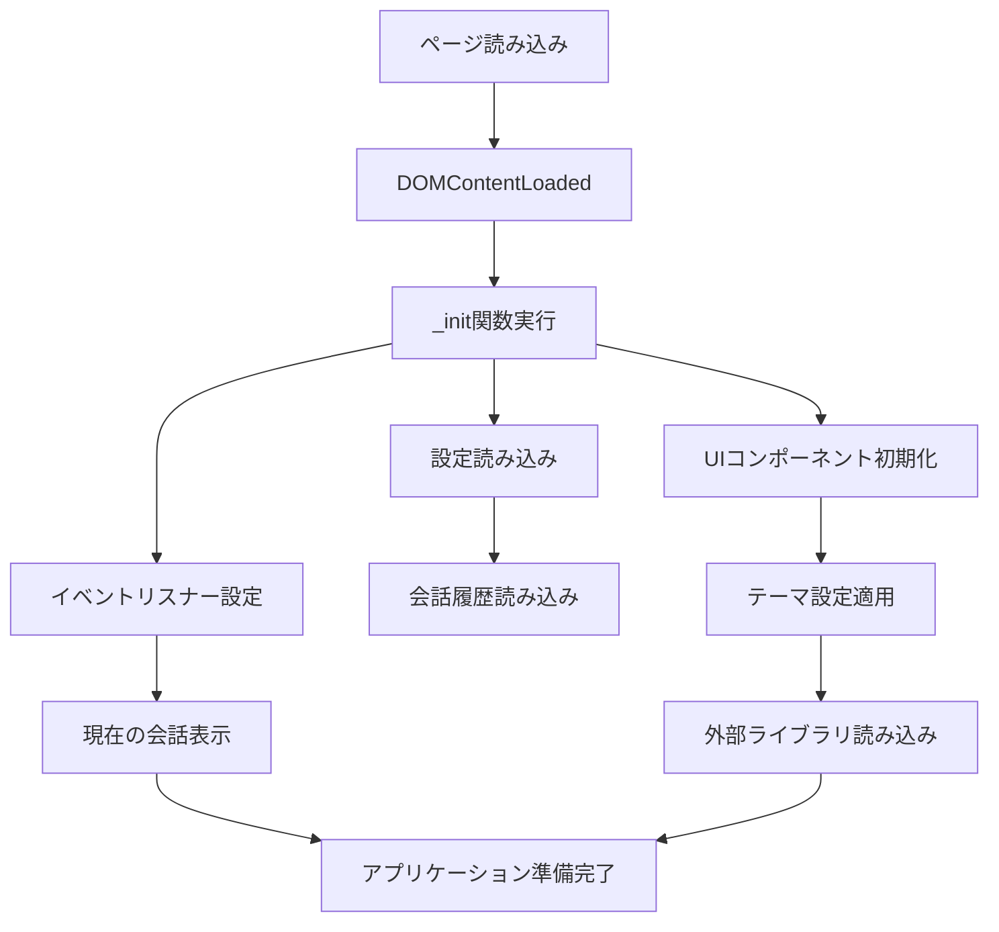

### メッセージ送信フロー

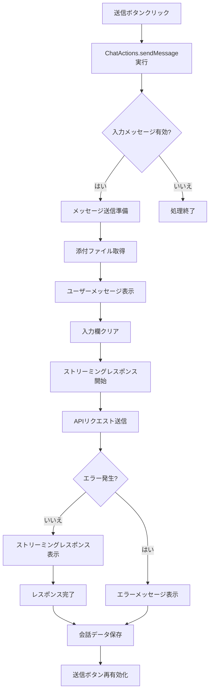

### ファイル添付フロー

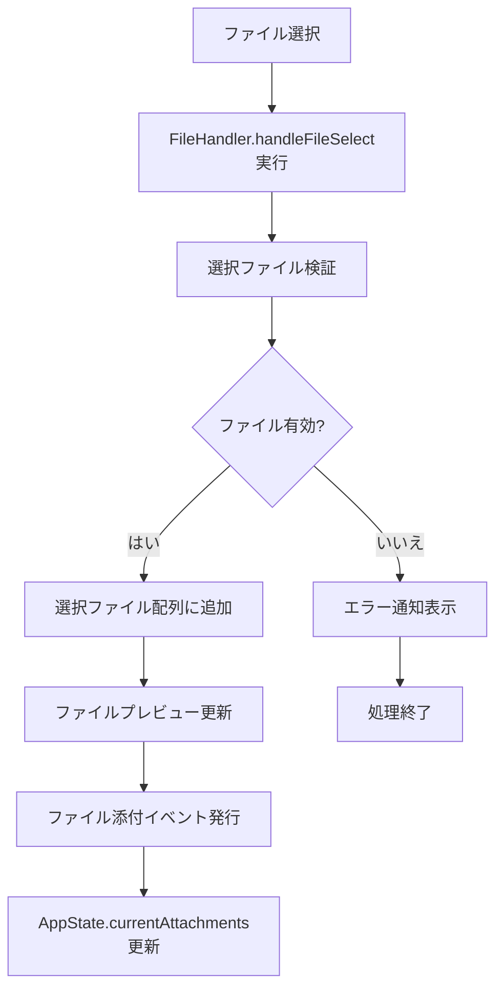

## シーケンス図

以下はChatBotアプリケーションの主要なシーケンス図です。

### メッセージ送信シーケンス

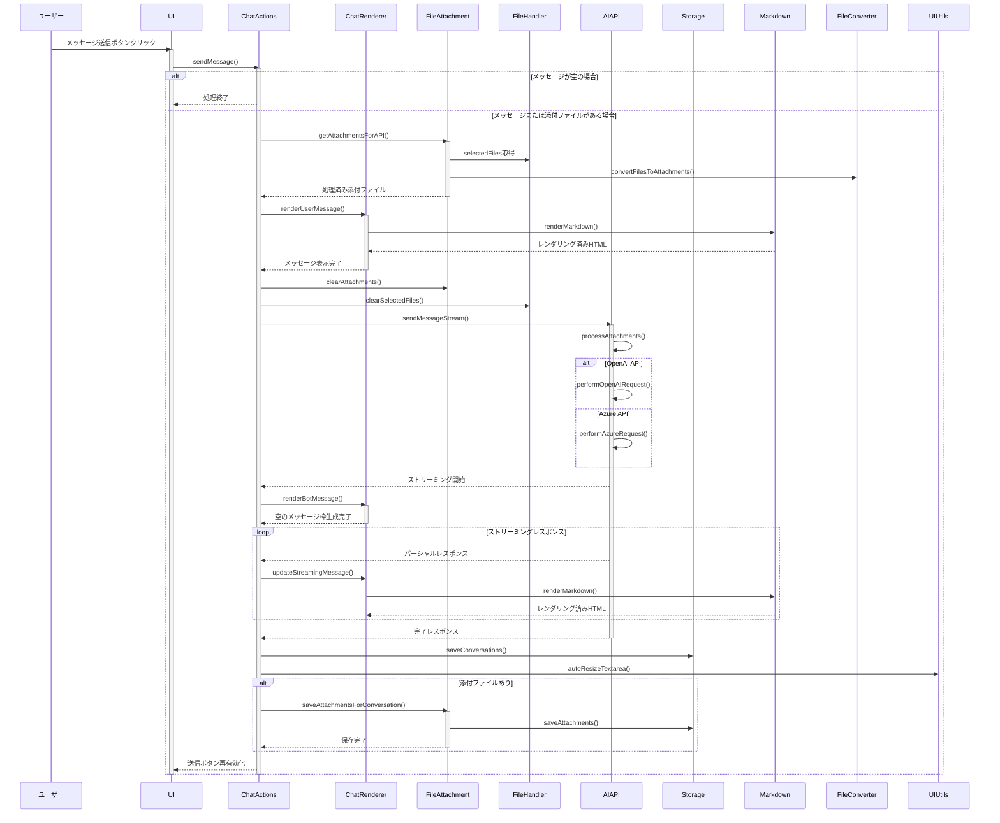

### システムプロンプト設定と適用シーケンス

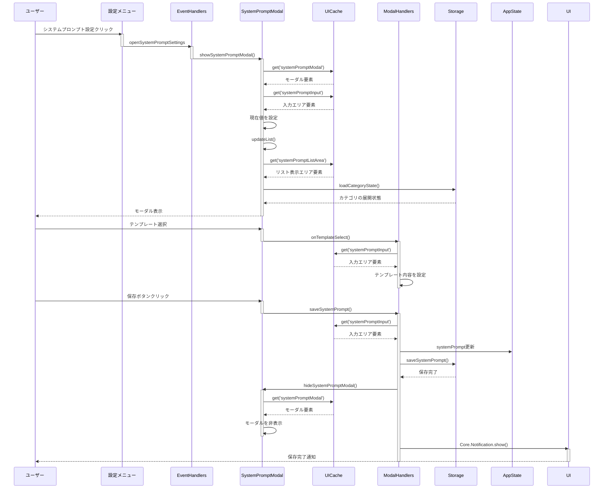

### 会話切り替えシーケンス

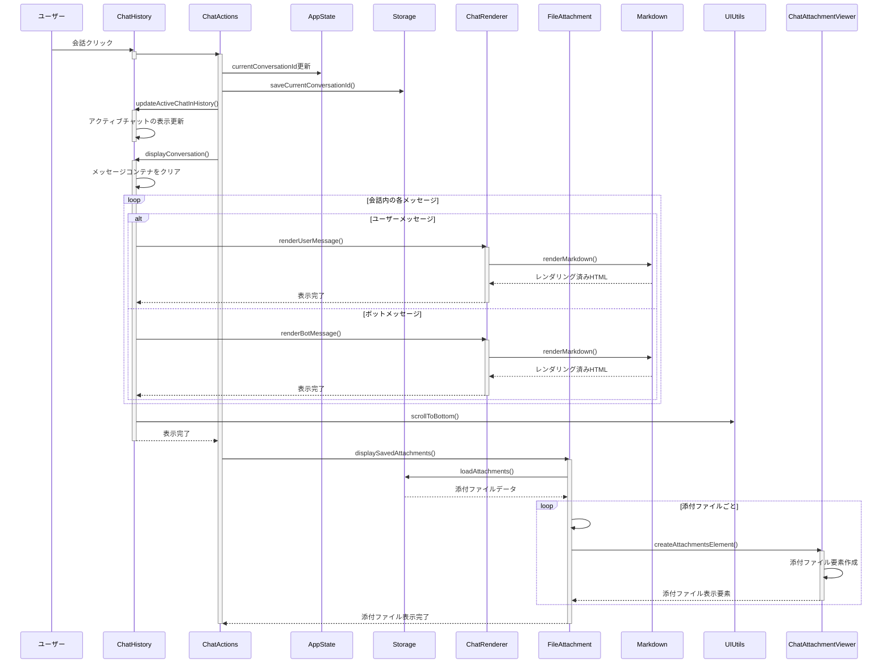

### ファイル添付処理シーケンス

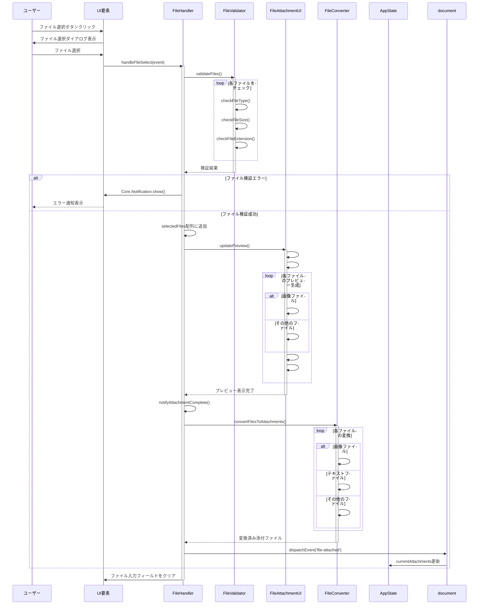

### 会話履歴管理シーケンス

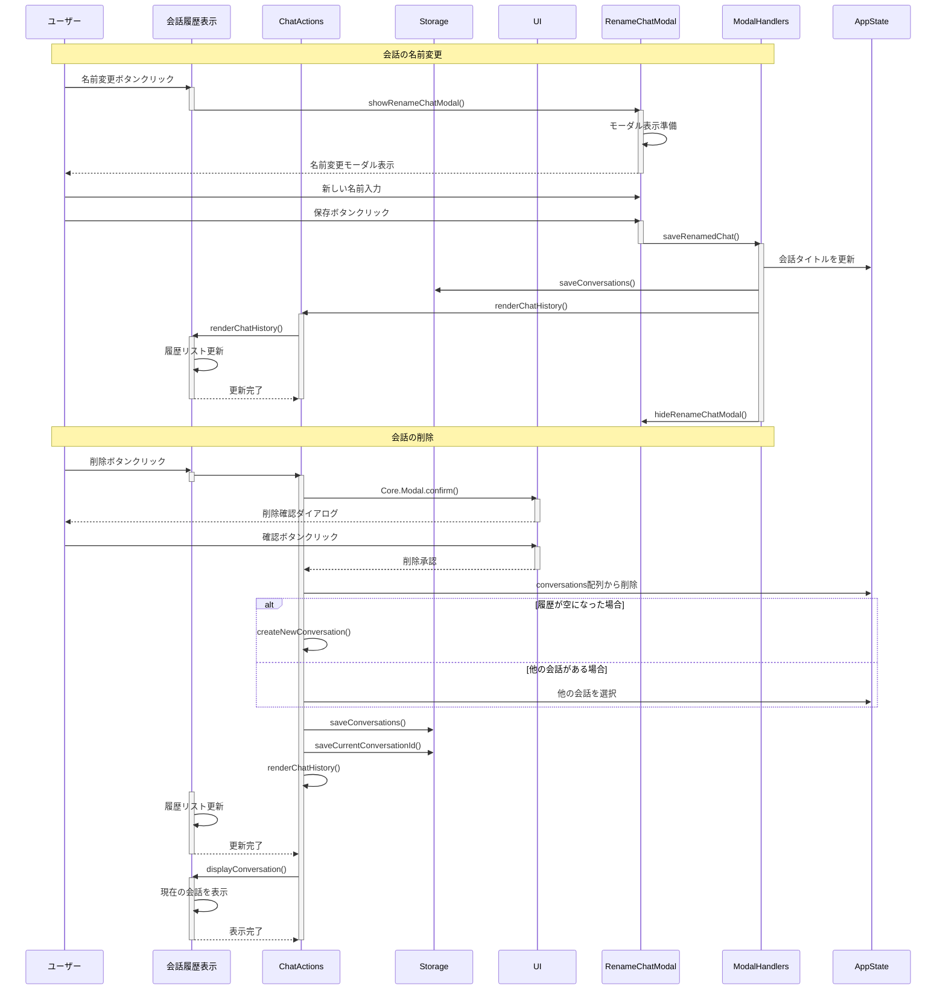

## APIインターフェース

ChatBotは主に以下の3つのAPIインターフェースを使用します：

### OpenAI API

**エンドポイント**: `https://api.openai.com/v1/chat/completions`

**認証**: Bearer Token (APIキー)

**リクエスト例**:
```json
{
  "model": "gpt-4o",
  "messages": [
    {"role": "system", "content": "あなたは優秀なAIアシスタントです。"},
    {"role": "user", "content": "こんにちは、今日の天気を教えてください。"}
  ],
  "stream": true,
  "max_tokens": 2000,
  "temperature": 0.7
}
```

**レスポンス例** (ストリーミングなし):
```json
{
  "id": "chatcmpl-123ABC...",
  "object": "chat.completion",
  "created": 1688662932,
  "model": "gpt-4o",
  "choices": [
    {
      "index": 0,
      "message": {
        "role": "assistant",
        "content": "こんにちは！私はAIアシスタントなので、実際の天気を確認することはできません。お住まいの地域の天気を知るには、天気予報アプリや気象庁のウェブサイトをご確認いただくのが最適です。"
      },
      "finish_reason": "stop"
    }
  ],
  "usage": {
    "prompt_tokens": 48,
    "completion_tokens": 102,
    "total_tokens": 150
  }
}
```

### Azure OpenAI API

**エンドポイント**: `https://{リソース名}.openai.azure.com/openai/deployments/{デプロイメント名}/chat/completions?api-version=2023-12-01-preview`

**認証**: APIキーをapi-keyヘッダーに設定

**リクエスト例**:
```json
{
  "messages": [
    {"role": "system", "content": "あなたは優秀なAIアシスタントです。"},
    {"role": "user", "content": "こんにちは、今日の天気を教えてください。"}
  ],
  "stream": true,
  "max_tokens": 2000,
  "temperature": 0.7
}
```

**レスポンス形式**: OpenAI APIと同様

### 添付ファイル付きメッセージのフォーマット

画像添付の場合:
```json
{
  "messages": [
    {"role": "system", "content": "あなたは優秀なAIアシスタントです。"},
    {
      "role": "user", 
      "content": [
        {"type": "text", "text": "この画像について説明してください。"},
        {
          "type": "image_url",
          "image_url": {
            "url": "data:image/jpeg;base64,/9j/4AAQSkZJRgABAQAAAQABAAD...",
            "detail": "high"
          }
        }
      ]
    }
  ]
}
```

ファイル添付の場合:
```json
{
  "messages": [
    {"role": "system", "content": "あなたは優秀なAIアシスタントです。"},
    {
      "role": "user", 
      "content": [
        {"type": "text", "text": "このコードを分析してください。"},
        {
          "type": "file",
          "name": "example.js",
          "content": "function hello() { console.log('Hello, world!'); }",
          "mimeType": "application/javascript"
        }
      ]
    }
  ]
}
```

### Compiler Explorer (Godbolt) API

**エンドポイント**: `https://godbolt.org/api/compiler/{compiler-id}/compile`

**リクエスト例**:
```json
{
  "source": "#include <iostream>\nint main() { std::cout << \"Hello World!\"; return 0; }",
  "options": {
    "compilerOptions": {
      "executorRequest": true,
      "skipAsm": true
    }
  },
  "allowStoreCodeDebug": true
}
```

**レスポンス例**:
```json
{
  "code": 0,
  "stdout": [
    {
      "text": "Hello World!"
    }
  ],
  "stderr": [],
  "execTime": "46",
  "processExecutionResultTime": 0.034,
  "buildResult": {
    "code": 0,
    "stdout": [],
    "stderr": [],
    "execTime": "123",
    "okToCache": true
  }
}
```

**主な機能**:
- GCC 12.2などの実際のC++コンパイラによるコンパイルと実行
- コンパイラオプションのカスタマイズ
- コンパイル結果とランタイム出力の分離
- エラー情報の詳細な取得

## セキュリティ考慮事項

ChatBotアプリケーションでは以下のセキュリティ対策を実装しています：

### APIキーの保護

- **クライアントサイド暗号化**: APIキーはブラウザのローカルストレージに保存する前に暗号化されます。
- **暗号化キー生成**: 暗号化キーはユーザー固有の情報と組み合わせて生成されます。
- **メモリ上の保護**: APIキーはJavaScriptのメモリ上に必要な間だけ保持されます。

### 入力データ検証

- **入力サニタイズ**: すべてのユーザー入力はHTMLエスケープ処理を施してからレンダリングします。
- **コンテンツセキュリティポリシー**: インラインスクリプトの実行制限とリソース制限を実装。
- **ファイル検証**: アップロードされるファイルは種類とサイズを検証します。

### データ保護

- **ローカルデータのみ**: すべてのチャットデータはブラウザのローカルストレージのみに保存され、サーバーには送信されません。
- **転送時の暗号化**: OpenAI/Azure APIとの通信はHTTPS経由で行われます。

### コード実行の隔離

- **サンドボックス化**: コード実行は専用のiframeまたは制限された実行環境内で行われます。
- **実行時間制限**: 無限ループを防ぐため、コード実行には時間制限があります。

## パフォーマンス最適化

ChatBotアプリケーションでは以下のパフォーマンス最適化を実施しています：

### DOM操作の最適化

- **DOMキャッシング**: `UICache`クラスを使用して頻繁にアクセスするDOM要素を効率的に管理します。
- **バッチ処理**: 多数のDOM要素を追加する場合、DocumentFragmentを使用してバッチ処理します。
- **仮想化リスト**: 大量のチャット履歴がある場合、表示範囲のみをレンダリングします。

### リソース読み込みの最適化

- **遅延読み込み**: Prism.js言語コンポーネントなど一部のリソースは必要に応じて動的に読み込みます。
- **リソースプリフェッチ**: 必要なリソースを予め読み込んで表示を高速化します。
- **キャッシュ制御**: 静的リソースのキャッシュヘッダーを最適化します。

### レンダリングパフォーマンス

- **スロットリング**: スクロールイベントや入力イベントのハンドラにはスロットリングを適用します。
- **メモ化**: 頻繁に呼び出される処理結果をキャッシュします。
- **CSS最適化**: レンダリングを阻害しないCSSの読み込み方法を採用します。

### データ管理の最適化

- **分割ストレージ**: 大きなデータは分割して保存し、必要に応じて読み込みます。
- **索引付け**: 検索や参照が頻繁なデータは索引付けして高速にアクセスできるようにします。
- **圧縮**: 添付ファイルなど大きなデータは適切に圧縮します。

## テスト計画

ChatBotアプリケーションの品質を確保するためのテスト計画は以下の通りです：

### 単体テスト

- **対象**: 各クラスの重要なメソッド、特にデータ変換、検証機能を中心に実施
- **ツール**: Jest, Mocha+Chai
- **実施頻度**: 重要な機能追加・変更時に実施

### 統合テスト

- **対象**: コンポーネント間のインタラクション、特にイベントハンドリング、API通信
- **ツール**: Cypress
- **実施頻度**: リリース前に必ず実施

### E2Eテスト

- **対象**: 実際のユーザーシナリオに基づいた一連の操作
- **ツール**: Cypress, Playwright
- **実施頻度**: メジャーリリース前に実施

### パフォーマンステスト

- **対象**: 大量メッセージ表示時のレンダリング速度、メモリ使用量
- **ツール**: Chrome DevTools, Lighthouse
- **実施頻度**: パフォーマンス改善時に実施

### クロスブラウザテスト

- **対象ブラウザ**: Chrome, Firefox, Safari, Edge
- **テスト内容**: 基本機能が正常に動作することを確認
- **実施頻度**: UIの大きな変更時に実施

### セキュリティテスト

- **対象**: 入力検証、APIキー保護、コンテンツセキュリティ
- **ツール**: OWASP ZAP, Manual Testing
- **実施頻度**: 四半期ごと

## 拡張計画

将来の拡張候補として以下の機能が検討されています：

1. **ローカルLLMサポート**
   - ローカルで実行可能なLLMモデルのサポート
   - オフライン動作モード
   - WebGPU/WebAssemblyを活用した高速推論

2. **プラグイン機能**
   - ウェブ検索、計算機能など拡張プラグインのサポート
   - カスタムプラグイン開発フレームワーク
   - プラグイン管理インターフェース

3. **音声入出力**
   - 音声入力による会話
   - テキスト読み上げ機能
   - 音声認識の精度向上のためのフィードバック機能

4. **RAG（検索拡張生成）機能**
   - ユーザー独自のドキュメントからの情報取得
   - ベクトルデータベースとの連携
   - ドキュメントのインデックス作成と検索機能

5. **マルチモーダル対応強化**
   - 画像認識・分析機能の拡張
   - 図表自動生成機能
   - 画像編集・加工機能

6. **チーム共有機能**
   - 会話履歴の共有・エクスポート
   - 複数ユーザーでの同時編集機能
   - 権限管理と共同作業スペース

7. **高度なプロンプト管理**
   - プロンプトの効果分析機能
   - 会話コンテキスト管理の強化
   - プロンプトテンプレートのインポート/エクスポート

8. **プロジェクト管理機能**
   - チャットを活用したタスク管理
   - 議事録自動作成
   - プロジェクトタイムライン表示

9. **高度なカスタマイズ**
   - UIテーマの完全カスタマイズ
   - キーボードショートカットのカスタマイズ
   - ワークフローの自動化
