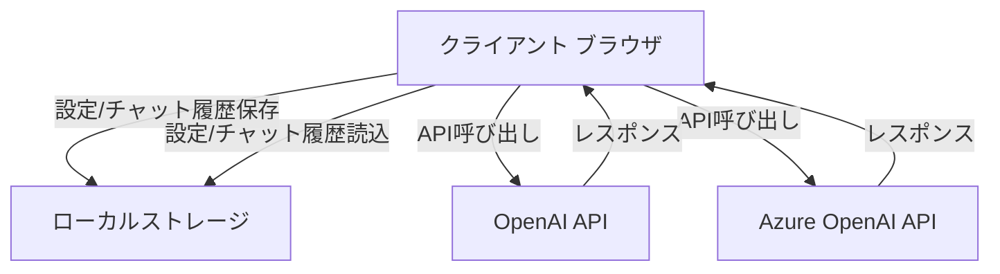
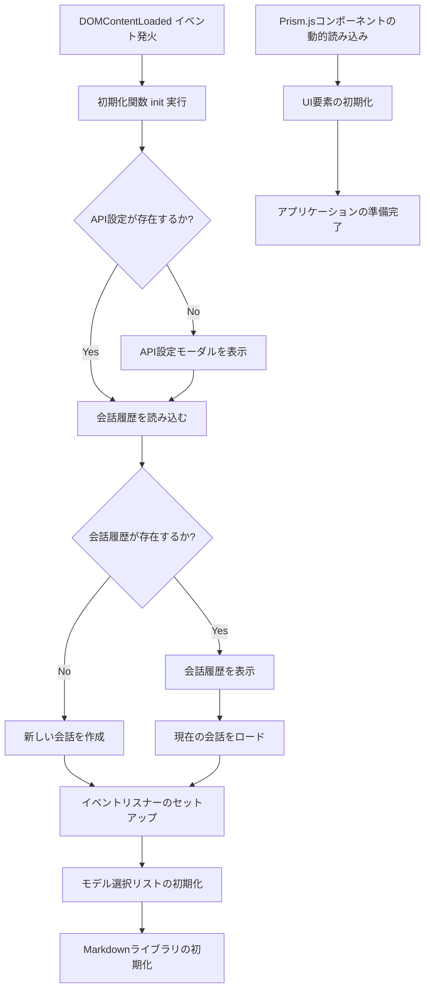
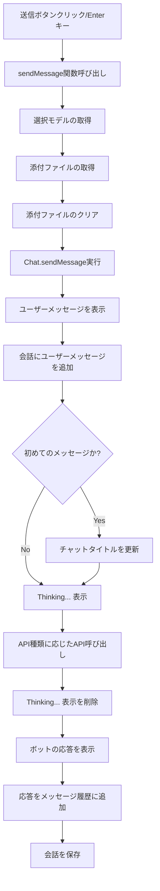
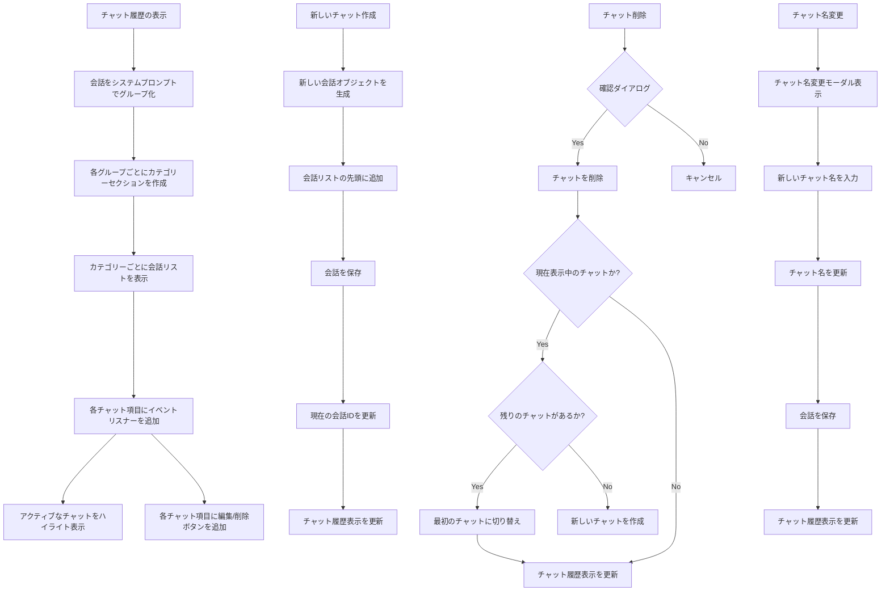
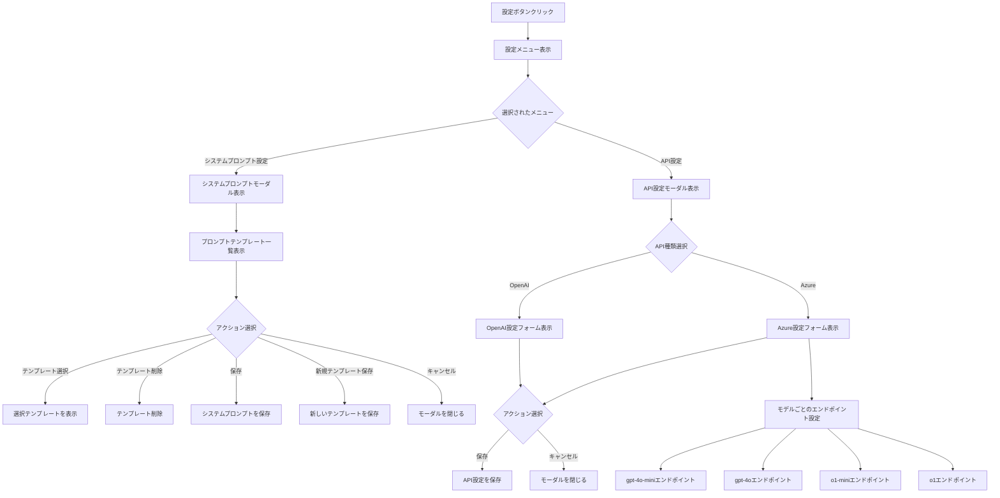
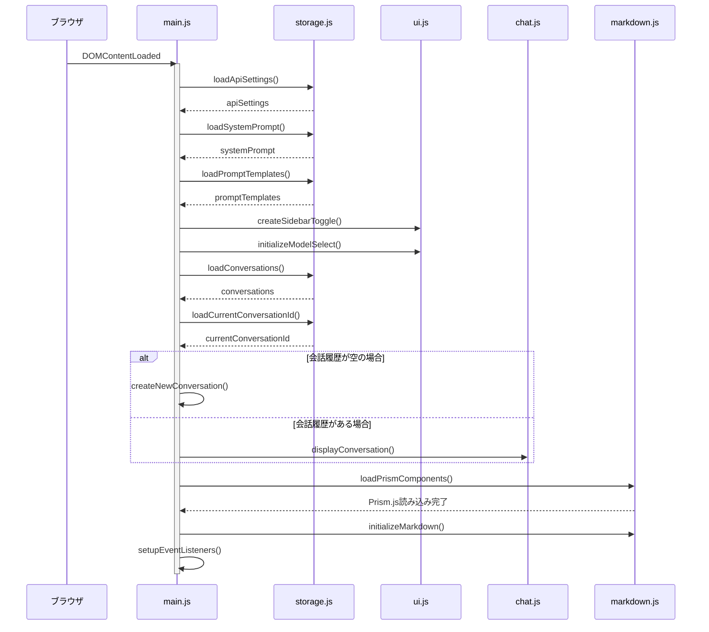
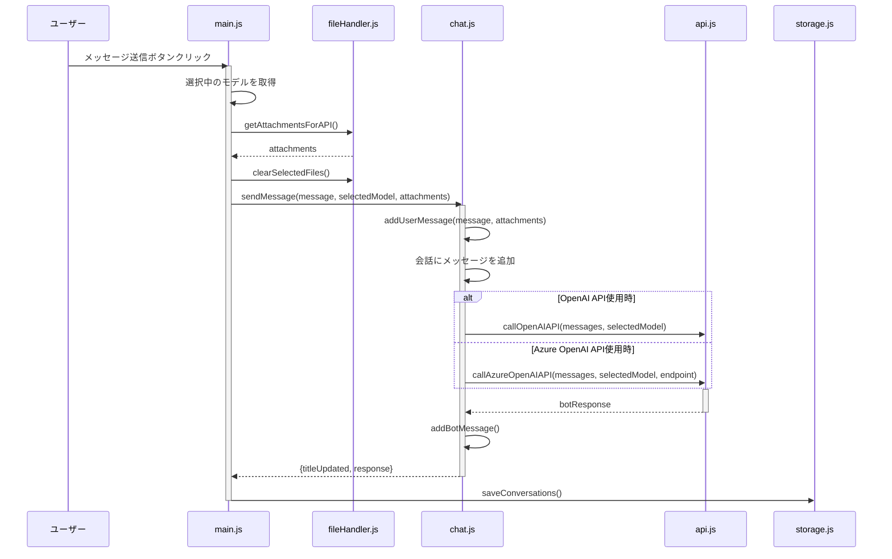
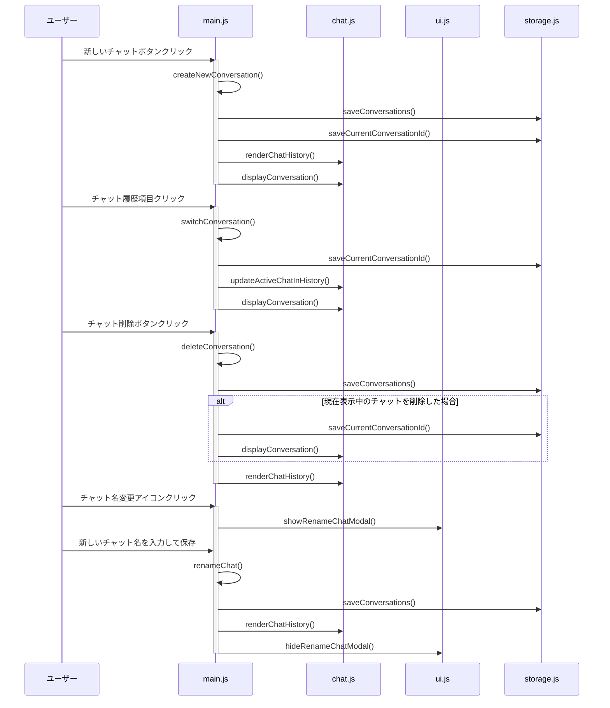
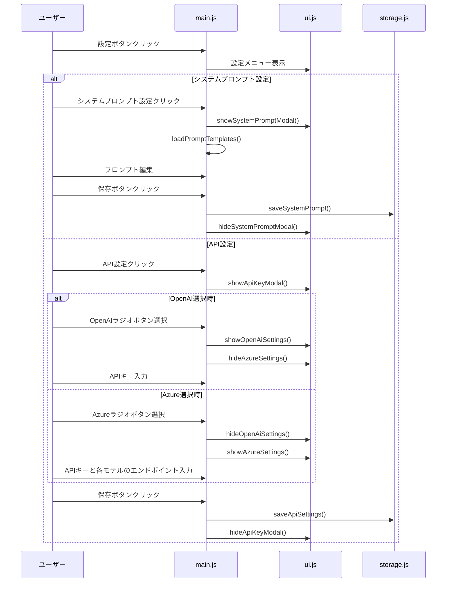

# ChatBot アプリケーション設計仕様書

**作成日**: 2025年3月29日  
**バージョン**: 1.0  
**作成者**: ChatBot開発チーム

## 目次

1. [概要](#概要)
2. [システムアーキテクチャ](#システムアーキテクチャ)
3. [ファイル構造](#ファイル構造)
4. [モジュール詳細](#モジュール詳細)
5. [データモデル](#データモデル)
6. [UI設計](#ui設計)
7. [フローチャート](#フローチャート)
8. [シーケンス図](#シーケンス図)
9. [APIインターフェース](#apiインターフェース)
10. [セキュリティ考慮事項](#セキュリティ考慮事項)
11. [パフォーマンス最適化](#パフォーマンス最適化)
12. [テスト計画](#テスト計画)
13. [拡張計画](#拡張計画)

## 概要

ChatBotはAI搭載のWebベースチャットアプリケーションです。OpenAIのAPIとAzure OpenAI APIを活用して、ユーザーに高度な対話体験を提供します。マークダウン形式のメッセージ表示、コードハイライト、ファイル添付機能などを備えた多機能アプリケーションです。

### 主な機能

- 複数のAIモデル対応（gpt-4o-mini、gpt-4o、o1-mini、o1）
- OpenAI/Azure OpenAI API対応
- マークダウン・コードシンタックスハイライト対応
- チャット履歴管理（保存・復元・削除・名前変更）
- システムプロンプトのカスタマイズとテンプレート機能
- ファイル添付機能
- レスポンシブデザイン

## システムアーキテクチャ

ChatBotはクライアントサイドのみで動作するSPA（Single Page Application）として設計されています。すべてのデータ処理と状態管理はブラウザ内で行われ、外部との通信はOpenAI/Azure OpenAI APIのみです。

### アーキテクチャ概略図



## ファイル構造

ChatBotアプリケーションは以下のファイル構造で構成されています:

```
ChatBot/
│
├── index.html               # メインのHTMLファイル
├── main.js                  # アプリケーションのエントリーポイント
├── ChatBot_設計仕様書.md    # 本設計仕様書
├── README.md                # プロジェクト概要説明
│
├── css/                     # スタイルシート関連ファイル
│   ├── base.css             # 基本スタイル
│   ├── chat.css             # チャットUI用スタイル
│   ├── components.css       # コンポーネント用スタイル
│   ├── layout.css           # レイアウト用スタイル
│   └── markdown.css         # マークダウン表示用スタイル
│
├── icon/                    # アプリケーションで使用するアイコン類
│   └── ChatBot.png          # アプリケーションアイコン
│
└── js/                      # JavaScriptモジュール
    ├── api.js               # API通信用モジュール
    ├── chat.js              # チャット機能コア実装
    ├── config.js            # 設定管理
    ├── cryptoHelper.js      # 暗号化/復号化ユーティリティ
    ├── fileHandler.js       # ファイル添付機能実装
    ├── markdown.js          # マークダウン処理
    ├── storage.js           # ローカルストレージ操作
    └── ui.js                # UI操作関連
```

## モジュール詳細

各モジュールの詳細な役割と責任範囲を説明します。

### main.js

アプリケーションのエントリーポイントであり、初期化処理およびコアロジックを実装しています。

**主な責任**:
- アプリケーションの初期化処理
- イベントリスナーのセットアップ
- 会話管理（作成・切替・削除・名前変更）
- 他のモジュールの連携・調整

### js/api.js

APIとの通信を担当するモジュールです。

**主な責任**:
- OpenAI APIとの通信
- Azure OpenAI APIとの通信
- エラーハンドリング
- リクエスト/レスポンスの整形

### js/chat.js

チャット機能のコア実装を担当します。

**主な責任**:
- メッセージの送受信制御
- ユーザー/ボットメッセージの表示
- チャット履歴の表示管理
- チャットUI操作

### js/config.js

アプリケーション設定の管理を担当します。

**主な責任**:
- デフォルト設定値の定義
- 設定情報の構造定義

### js/fileHandler.js

ファイル添付機能の実装を担当します。

**主な責任**:
- ファイル選択UI操作
- ファイル処理（読込・変換）
- API送信用ファイルデータの生成

### js/markdown.js

マークダウンのレンダリングとコードハイライトを担当します。

**主な責任**:
- マークダウンテキストのHTML変換
- コードブロックの言語検出と適切なハイライト
- Prism.jsのダイナミックロード制御

### js/storage.js

ローカルストレージを使ったデータ永続化を担当します。

**主な責任**:
- API設定の保存/読込
- 会話履歴の保存/読込
- システムプロンプトの保存/読込
- プロンプトテンプレートの管理

### js/ui.js

UI操作およびモーダル管理を担当します。

**主な責任**:
- モーダルの表示/非表示制御
- UI要素の動的生成
- イベントハンドラ登録
- アニメーション・視覚効果

### js/cryptoHelper.js

機密情報の暗号化と復号化を担当するユーティリティモジュールです。

**主な責任**:
- APIキーなどのセンシティブ情報の暗号化
- 暗号化されたデータの復号化
- 暗号化状態の検出と管理

## データモデル

アプリケーションで使用される主要なデータ構造を定義します。

### 会話（Conversation）オブジェクト

```javascript
{
  id: "unique-id-string",               // 会話を一意に識別するID
  title: "会話のタイトル",              // 会話のタイトル
  systemPrompt: "AIへの指示プロンプト", // システムプロンプト
  messages: [                          // メッセージ配列
    {
      role: "user" | "assistant" | "system", // メッセージの送信者
      content: "メッセージ内容",            // テキスト内容
      timestamp: 1616161616161,             // タイムスタンプ
      attachments: [                        // 添付ファイル（ある場合）
        {
          type: "image/png",                // MIMEタイプ
          data: "base64エンコードデータ",   // ファイルデータ
          name: "ファイル名.png"            // ファイル名
        }
      ]
    }
  ],
  createdAt: 1616161616161,            // 会話作成タイムスタンプ
  updatedAt: 1616161616161             // 最終更新タイムスタンプ
}
```

### API設定オブジェクト

```javascript
{
  type: "openai" | "azure",           // API種類
  openaiApiKey: "sk-...",             // OpenAI APIキー
  azureApiKey: "...",                 // Azure APIキー
  azureEndpoints: {                   // Azureモデル別エンドポイント
    "gpt-4o-mini": "エンドポイントURL",
    "gpt-4o": "エンドポイントURL",
    "o1-mini": "エンドポイントURL",
    "o1": "エンドポイントURL"
  }
}
```

### プロンプトテンプレートオブジェクト

```javascript
{
  id: "unique-id-string",        // テンプレートID
  name: "テンプレート名",        // 表示名
  content: "プロンプト内容",     // プロンプト本文
  createdAt: 1616161616161      // 作成タイムスタンプ
}
```

## UI設計

ChatBotアプリケーションのUI構成をセクション別に解説します。

### メインレイアウト

```
+---------------------+--------------------------------+
|                     |                                |
|    サイドバー        |       メインチャットエリア      |
|  (チャット履歴)      |                                |
|                     |                                |
|                     |                                |
|                     |                                |
|                     |                                |
|                     |                                |
|                     |                                |
|                     |                                |
|                     |                                |
+---------------------+--------------------------------+
```

### UI構成要素

1. **サイドバー**
   - 新規チャットボタン
   - チャット履歴リスト
   - 設定ボタン
   - 履歴クリアボタン

2. **メインチャットエリア**
   - ヘッダー（タイトルとモデル選択）
   - メッセージ表示領域
   - 入力フォーム（テキスト入力、ファイル添付、送信ボタン）

3. **モーダルダイアログ**
   - API設定モーダル
   - システムプロンプト設定モーダル
   - チャット名変更モーダル

## フローチャート

### アプリケーション初期化フロー



### メッセージ送信フロー



### チャット履歴管理フロー



### 設定管理フロー



## シーケンス図

### アプリケーション初期化シーケンス



### メッセージ送信シーケンス



### チャット履歴管理シーケンス



### 設定管理シーケンス



## APIインターフェース

### OpenAI API

**エンドポイント**: `https://api.openai.com/v1/chat/completions`

**リクエスト形式**:
```javascript
{
  model: "gpt-4o-mini" | "gpt-4o" | "o1-mini" | "o1",
  messages: [
    { role: "system", content: "..." },
    { role: "user", content: "..." },
    { role: "assistant", content: "..." },
    ...
  ],
  temperature: 0.7,
  max_tokens: 1000
}
```

### Azure OpenAI API

**エンドポイント**: 各モデルごとに異なる設定が必要

**リクエスト形式**:
```javascript
{
  messages: [
    { role: "system", content: "..." },
    { role: "user", content: "..." },
    { role: "assistant", content: "..." },
    ...
  ],
  temperature: 0.7,
  max_tokens: 1000
}
```

## セキュリティ考慮事項

1. **APIキーの保護**
   - APIキーおよびAzureエンドポイントURLはローカルストレージに暗号化して保存されます
   - 暗号化にはXORベースの暗号化とBase64エンコーディングを使用
   - 暗号化データは「ENC:」プレフィックスで識別され、自動的に復号化されます
   - 暗号化キーはデバイス固有情報とアプリケーション固有のソルトから生成

2. **データプライバシー**
   - すべての会話データはクライアント端末内のローカルストレージに保存
   - サーバーサイドにデータが送信されることはありません（OpenAI/Azure API以外）
   - 会話内容自体は暗号化されませんが、必要に応じて将来的に実装可能

3. **入力検証**
   - ユーザー入力は適切に検証・サニタイズする必要があります
   - 悪意あるスクリプトの挿入を防止するメカニズムを実装

## パフォーマンス最適化

1. **マークダウンレンダリング**
   - 長文レンダリング時のパフォーマンス対策
   - コードハイライト言語のオンデマンドロード

2. **会話履歴管理**
   - 会話履歴が肥大化した場合のページングや仮想スクロール

3. **ファイル添付**
   - 画像サイズの適切な圧縮・リサイズ
   - 大型ファイル処理時の非同期処理とプログレス表示

## 拡張計画

将来の拡張候補として以下の機能が検討されています：

1. **ローカルLLMサポート**
   - ローカルで実行可能なLLMモデルのサポート
   - オフライン動作モード

2. **ストリーミングレスポンス**
   - 回答をリアルタイムで表示するストリーミングモード
   - タイピングアニメーション

3. **プラグイン機能**
   - ウェブ検索、計算機能など拡張プラグインのサポート
   - カスタムプラグイン開発フレームワーク

4. **音声入出力**
   - 音声入力による会話
   - テキスト読み上げ機能
