# ChatBot アプリケーション クラス図

このドキュメントはChatBotアプリケーションの主要なクラスとその関連性を表すクラス図です。

## 主要クラス構成

```mermaid
classDiagram
    %% コアクラス
    class UI {
        -static #instance
        +static getInstance()
        -constructor()
        +initialize()
        +Core~Theme
        +Core~Notification
        +Core~Modal
        +Core~Accessibility
        +Core~TouchOptimization
    }
    
    class Storage {
        -static #instance
        +static getInstance()
        -constructor()
        +setItem(key, value)
        +getItem(key)
        +saveConversations()
        +loadConversations()
        +saveSystemPrompt()
        +loadSystemPrompt()
        +saveApiSettings()
        +loadApiSettings()
        +saveAttachments()
        +loadAttachments()
        +saveCategoryState()
        +loadCategoryState()
    }
    
    class UIUtils {
        -static #instance
        +static getInstance()
        -constructor()
        +toggleVisibility()
        +toggleModal()
        +createElement(tag, props)
        +autoResizeTextarea()
        +scrollToBottom()
    }
    
    class UICache {
        -static #instance
        +static getInstance()
        -constructor()
        +get(selector, useQuerySelector)
        +set(selector, element)
        +clear()
    }
    
    class EventHandlers {
        -static #instance
        +static getInstance()
        -constructor()
        +setupChatEvents()
        +setupSettingsEvents()
        +setupFileEvents()
        +setupGlobalEvents()
        +setupModalEvents()
        -#setupSystemPromptModal()
        -#setupApiKeyModal()
        -#setupRenameChatModal()
        -#setupPromptManagerModal()
    }
    
    class AIAPI {
        -static #instance
        +static getInstance()
        -constructor()
        +sendMessage()
        +sendMessageStream()
        -processAttachments()
        -performOpenAIRequest()
        -performAzureRequest()
    }
    
    %% チャットコンポーネント
    class ChatActions {
        -static #instance
        +static getInstance()
        -constructor()
        +sendMessage()
        +createNewConversation()
        +clearAllHistory()
        +renderChatHistory()
        -#switchConversation()
        -#deleteConversation()
    }
    
    class ChatHistory {
        -static #instance
        +static getInstance()
        -constructor()
        +renderChatHistory()
        +updateActiveChatInHistory()
        +displayConversation()
        -formatTimestamp()
    }
    
    class ChatRenderer {
        -static #instance
        +static getInstance()
        -constructor()
        +renderUserMessage()
        +renderBotMessage()
        +clearStreamingMessage()
        +updateStreamingMessage()
        -highlightCode()
    }
    
    class ChatAttachmentViewer {
        -static #instance
        +static getInstance()
        -constructor()
        +createAttachmentsElement()
        +showFullSizeImage()
        -createImageAttachment()
        -createFileAttachment()
        -formatTextContent()
    }
    
    class ChatUI {
        -static #instance
        +static getInstance()
        -constructor()
        +createElement(tag, options)
        +formatTimestamp()
        +adjustScroll()
        +initializeCodeEditor()
        +showCodeEditor()
        -#executeEditorCode()
    }
    
    %% ファイル関連クラス
    class FileAttachment {
        -static #instance
        +static getInstance()
        -constructor()
        +clearAttachments()
        +getAttachmentsForAPI()
        +saveAttachmentsForConversation()
        +displaySavedAttachments()
        -loadAttachmentsForConversation()
        -findClosestMessageIndex()
    }
    
    class FileAttachmentUI {
        -static #instance
        +static getInstance()
        -constructor()
        +updatePreview()
        +clearPreview()
        -#getOrCreatePreviewArea()
        -#createFilePreviewItems()
        -#createFilePreview()
        -#createImagePreview()
        -#createFileInfo()
    }
    
    class FileHandler {
        -static #instance
        +static getInstance()
        -constructor()
        +selectedFiles
        +savedAttachments
        +attachmentTimestamp
        +init()
        +updateAcceptedFileTypes()
        +handleFileSelect()
        +notifyAttachmentComplete()
        +clearSelectedFiles()
        -getAllowedFileExtensions()
    }
    
    class FileConverter {
        -static #instance
        +static getInstance()
        -constructor()
        +convertFilesToAttachments()
        -convertFileToAttachment()
        -convertImageToAttachment()
        -convertTextToAttachment()
    }
    
    class FileReaderUtil {
        -static #instance
        +static getInstance()
        -constructor()
        +readAsDataURL()
        +readAsText()
        +readAsArrayBuffer()
    }
    
    class FileValidator {
        -static #instance
        +static getInstance()
        -constructor()
        +validateFiles()
        -checkFileType()
        -checkFileSize()
        -checkFileExtension()
    }
    
    %% ユーティリティクラス
    class Markdown {
        -static #instance
        +static getInstance()
        -constructor()
        -_libraryStatus
        +initializeMarkdown()
        +loadScript()
        +renderMarkdown()
        +escapeHtml()
        +getCodeLanguage()
    }
    
    class CryptoHelper {
        -static #instance
        +static getInstance()
        -constructor()
        +encrypt()
        +decrypt()
        -generateEncryptionKey()
    }
    
    %% モーダルクラス
    class ApiSettingsModal {
        -static #instance
        +static getInstance()
        -constructor()
        +showApiKeyModal()
        +hideApiKeyModal()
        +toggleAzureSettings()
    }
    
    class SystemPromptModal {
        -static #instance
        +static getInstance()
        -constructor()
        +showSystemPromptModal()
        +hideSystemPromptModal()
        +updateList()
        -createPromptItem()
    }
    
    class PromptManagerModal {
        -static #instance
        +static getInstance()
        -constructor()
        +showPromptManagerModal()
        +hidePromptManagerModal()
        +showPromptEditModal()
        +hidePromptEditModal()
        +handleAddCategory()
        -updatePromptCategories()
    }
    
    class RenameChatModal {
        -static #instance
        +static getInstance()
        -constructor()
        +showRenameChatModal()
        +hideRenameChatModal()
    }
    
    class ModalHandlers {
        -static #instance
        +static getInstance()
        -constructor()
        +saveApiSettings()
        +saveRenamedChat()
        +saveNewSystemPrompt()
        +onTemplateSelect()
        +onTemplateDelete()
    }
    
    %% サイドバークラス
    class Sidebar {
        -static #instance
        +static getInstance()
        -constructor()
        +toggleSidebar()
        +createToggleButton()
        -handleResize()
    }
    
    %% コード実行クラス
    class ExecutorBase {
        +execute(code)* 
        #_loadRuntime()*
        #_executeCode(code)*
        #_formatResult(result)*
    }
    
    class JavaScriptExecutor {
        -static #instance
        +static getInstance()
        -constructor()
        +execute(code)
        #_loadRuntime()
        #_executeCode(code)
        #_formatResult(result)
    }
    
    class PythonExecutor {
        -static #instance
        +static getInstance()
        -constructor()
        +execute(code)
        #_loadRuntime()
        #_executeCode(code)
        #_formatResult(result)
    }
    
    class CPPExecutor {
        -static #instance
        +static getInstance()
        -constructor()
        +execute(code)
        #_loadRuntime()
        #_executeCode(code)
        #_formatResult(result)
    }
    
    class HTMLExecutor {
        -static #instance
        +static getInstance()
        -constructor()
        +execute(code)
        #_loadRuntime()
        #_executeCode(code)
        #_formatResult(result)
    }
    
    class CodeExecutor {
        -static #instance
        +static getInstance()
        -constructor()
        +detectLanguage()
        +execute()
        -getExecutor()
    }
    
    %% 継承関係
    ExecutorBase <|-- JavaScriptExecutor
    ExecutorBase <|-- PythonExecutor
    ExecutorBase <|-- CPPExecutor
    ExecutorBase <|-- HTMLExecutor
    
    %% コアクラス間の関係
    UI --> UICache
    UI --> UIUtils
    UI ..> Storage: 設定読み込み・保存
    EventHandlers --> UICache: DOM要素取得
    EventHandlers --> ChatActions: イベント委譲
    EventHandlers --> FileHandler: イベント委譲
    EventHandlers --> ModalHandlers: イベント委譲
    
    %% モーダル関連
    EventHandlers --> ApiSettingsModal: モーダル表示・非表示
    EventHandlers --> SystemPromptModal: モーダル表示・非表示
    EventHandlers --> RenameChatModal: モーダル表示・非表示
    EventHandlers --> PromptManagerModal: モーダル表示・非表示
    ModalHandlers --> ApiSettingsModal: モーダル制御
    ModalHandlers --> SystemPromptModal: モーダル制御
    ModalHandlers --> RenameChatModal: モーダル制御
    ModalHandlers --> PromptManagerModal: モーダル制御
    ModalHandlers --> Storage: 設定保存
    ModalHandlers --> UICache: DOM要素取得
    ModalHandlers --> UI: 通知表示
    ApiSettingsModal --> UICache: DOM要素取得
    SystemPromptModal --> UICache: DOM要素取得
    SystemPromptModal --> Storage: テンプレート取得
    RenameChatModal --> UICache: DOM要素取得
    PromptManagerModal --> UICache: DOM要素取得
    PromptManagerModal --> Storage: テンプレート取得
    
    %% ファイル関連
    FileHandler --> FileValidator: ファイル検証
    FileHandler --> FileAttachmentUI: プレビュー更新
    FileHandler --> FileConverter: ファイル変換
    FileAttachment --> Storage: 添付ファイル保存・読込
    FileAttachment --> FileHandler: ファイル情報取得
    FileAttachment --> ChatAttachmentViewer: 添付ファイル表示
    FileAttachmentUI --> FileHandler: ファイル情報取得
    FileConverter --> FileReaderUtil: ファイル読込
    
    %% チャット関連
    ChatActions --> AIAPI: API通信
    ChatActions --> Storage: 会話保存・読込
    ChatActions --> ChatHistory: 会話表示
    ChatActions --> ChatRenderer: メッセージ表示
    ChatActions --> FileAttachment: 添付ファイル処理
    ChatActions --> FileHandler: ファイル処理
    ChatActions --> UIUtils: テキストエリアリサイズ
    ChatActions --> RenameChatModal: モーダル表示
    
    ChatHistory --> UIUtils: スクロール制御
    ChatHistory --> ChatRenderer: メッセージ表示
    ChatHistory --> ChatUI: 要素生成
    ChatHistory --> FileAttachment: 添付ファイル表示
    
    ChatRenderer --> Markdown: マークダウン処理
    ChatRenderer --> UIUtils: DOM要素生成
    ChatRenderer --> ChatUI: 要素生成
    ChatRenderer --> ChatAttachmentViewer: 添付ファイル表示
    ChatRenderer --> CodeExecutor: コード実行
    
    ChatAttachmentViewer --> Markdown: コード表示処理
    ChatAttachmentViewer --> ChatUI: 要素生成
    
    %% コード実行関連
    CodeExecutor --> JavaScriptExecutor: 実行委譲
    CodeExecutor --> PythonExecutor: 実行委譲
    CodeExecutor --> CPPExecutor: 実行委譲
    CodeExecutor --> HTMLExecutor: 実行委譲
    
    %% サイドバー関連
    Sidebar --> UICache: DOM要素取得
    
    %% API関連
    AIAPI --> CryptoHelper: APIキー復号化
    AIAPI --> FileConverter: 添付ファイル処理
    AIAPI --> Storage: API設定取得
```

## クラスの主な役割

### コアクラス
- **UI**: ユーザーインターフェイスの操作を担当するコアクラス
- **Storage**: ローカルストレージを使用したデータの永続化を担当
- **UIUtils**: UI操作のためのユーティリティ機能を提供
- **UICache**: DOM要素の効率的なキャッシュ管理
- **EventHandlers**: アプリケーション全体のイベント処理を管理
- **AIAPI**: OpenAIおよびAzure OpenAI APIとの通信を担当

### チャットコンポーネント
- **ChatActions**: メッセージ送信や会話管理などのアクション
- **ChatHistory**: 会話履歴の表示と管理
- **ChatRenderer**: メッセージのレンダリングとマークダウン処理
- **ChatAttachmentViewer**: 添付ファイルのプレビューと表示
- **ChatUI**: チャット関連のUI要素生成と管理

### ファイル関連クラス
- **FileAttachment**: ファイル添付機能を管理
- **FileAttachmentUI**: ファイル添付のUI表示を管理
- **FileHandler**: ファイル選択とイベント処理
- **FileConverter**: ファイルデータの変換処理
- **FileReaderUtil**: ファイル読み込み処理のユーティリティ
- **FileValidator**: ファイルの検証と制限管理

### ユーティリティクラス
- **Markdown**: マークダウン処理とレンダリング
- **CryptoHelper**: APIキーの暗号化と復号処理

### モーダルクラス
- **ApiSettingsModal**: API設定モーダルの管理
- **SystemPromptModal**: システムプロンプト設定モーダルの管理
- **PromptManagerModal**: ユーザープロンプト管理モーダルの管理
- **RenameChatModal**: チャット名変更モーダルの管理
- **ModalHandlers**: モーダル関連のイベント処理

### サイドバークラス
- **Sidebar**: サイドバーの表示と管理

### コード実行クラス
- **ExecutorBase**: コード実行の基底クラス
- **JavaScriptExecutor**: JavaScript実行を担当
- **PythonExecutor**: Python実行を担当
- **CPPExecutor**: C++実行を担当
- **HTMLExecutor**: HTML/CSS/JS実行を担当
- **CodeExecutor**: 言語検出と実行の委譲を担当

## 設計パターン

このアプリケーションでは、以下の設計パターンが採用されています：

1. **シングルトンパターン**: すべてのクラスがシングルトンとして実装され、`getInstance()`メソッドを通じて唯一のインスタンスにアクセスします
2. **ストラテジーパターン**: `CodeExecutor`クラスが言語に応じて適切な実行クラスを選択する際に使用
3. **ファサードパターン**: 高レベルのインターフェイスとして複雑なサブシステムを隠蔽
4. **オブザーバーパターン**: イベント処理でのイベントリスナー実装
5. **メディエーターパターン**: `EventHandlers`がクラス間の協調を仲介

## 関連性の種類

- **実線矢印(`-->`)**: あるクラスが別のクラスを直接利用（依存）
- **点線矢印(`..>`)**: 弱い依存関係
- **三角矢印(`<|--`)**: 継承関係
